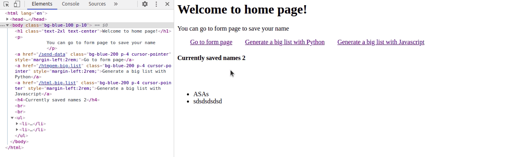

# HTMGEM 

Generate HTML with Python (Inspired by [Mithriljs](https://mithril.js.org/)). 


`htmgem` is a collection of html tags as functions. 
This allows you to create dinamically html pages and **html components** on the backend with python.


## Quickstart

```py

pip3 install htmgem

```

Bellow you have an html boilerplate created with htmgem:

```py

from htmgem.tags import *


html_string = \
html({'lang':'en'}, [
    head([
        meta({'charset':'UTF-8'}),
        meta({'name':'viewport', 'content':'width=device-width, initial-scale=1.0'}),
        link({'rel':'stylesheet', 'href':'https://cdnjs.cloudflare.com/ajax/libs/tailwindcss/2.1.2/tailwind.min.css'}), 
        script({'src':'https://cdn.jsdelivr.net/gh/alpinejs/alpine@v2.x.x/dist/alpine.min.js', 'defer':None})
    ]),

    body([
        h1("Interesting title"),

        p("A very long paragraph"),

        ul({"class": "somediv"}, [
            (li, "item1"),
            (li, "item2"),
            (li, {"id": "myid", "class":"important"}, "item3"),
        ])
    ])
])

```

The html equivalent would look like this:

```html
<html lang="en">
<head>
    <meta charset="UTF-8">
    <meta http-equiv="X-UA-Compatible" content="IE=edge">
    <meta name="viewport" content="width=device-width, initial-scale=1.0">
    <link rel="stylesheet" href="https://cdnjs.cloudflare.com/ajax/libs/tailwindcss/2.1.2/tailwind.min.css">
    <script src="https://cdn.jsdelivr.net/gh/alpinejs/alpine@v2.x.x/dist/alpine.min.js" defer></script>
</head>
<body>

    <h1>Interesting title</h1>

    <p>A very long paragraph</p>

    <ul class="somediv">
        <li>item1</li>
        <li>item2</li>
        <li id="myid" class="important">item3</li>
    </ul>
    
</body>
</html>
```

As you can see `html` is a function and same is the case for `body`, `p`, `ul`, `li` etc.


Each tag function receives `attributes` and `children` as parameters. 

Some examples:

```py

p(attrs={'class':'bg-gray-100', 'id':'first-paragraph'}, children="My paragraph")
#'<p class="bg-gray-100" id="first-paragraph">My paragraph</p>'

p({'class':'bg-gray-100', 'id':'first-paragraph'})
# '<p class="bg-gray-100" id="first-paragraph"></p>'

p("My paragraph")
# '<p>My paragraph</p>'

p()
# '<p></p>'

div({'class': 'flex items-center'}, [p(f"My paragraph{nbr}") for nbr in range(3)])
# '<div class="flex items-center"><p>My paragraph0</p><p>My paragraph1</p><p>My paragraph2</p></div>'
​
div([p, p, p])
# '<div><p></p><p></p><p></p></div>'


input_({'type':'text', 'required':None})
# '<input type="text" required></input>' 

```

- `attrs` : is a dictionary which contains attribute name (class, id, anything) and the corresponding value;
- `children`: can be a string or a list of other tag functions (ul, li etc);
- `attrs` and `children` are positional and optional parameters;


This is how you can create a component:

```py
def Link(path, content):

    class_list = [
        'bg-blue-200',
        'p-4',
        'cursor-pointer'
    ]    

    return a(
        {"href": path, "class": class_list, 'style':'margin-left:2rem;'}, 
        content
    )


Link('/users', 'see users')
# '<a href="/users" class="bg-blue-200 p-4 cursor-pointer" style="margin-left:2rem;">see users</a>'

```

Now you can pass `Link` component in any other function tag (p, div, body etc).


This is how a generated list would look like:

```py

data_list = [1,2,3,4] # something from your database

def DataNbrList():
    #Whatever operations you want to do on data
    
    htmli = []
    for item in data_list:
        htmli.append(li(item))

    return [
        h4(f"Currently saved names {len(htmli)}"),
        ul(htmli)
    ]


div(DataNbrList())
# '<div><h4>Currently saved names 4</h4><ul><li>1</li><li>2</li><li>3</li><li>4</li></ul></div>'

```


I quess by now you got a feel on how `htmgem` works, how you can integrate htmgem with Flask or other framework?

> HTML is just text (more specifically text/html)

```py
from flask import Flask, request
from functools import lru_cache # trick for max performance
from htmgem.tags import *


app = Flask(__name__)


# This can be imported from another file
Layout = lambda page_title, page_content: \
html({'lang':'en'}, [
    head([
        meta({'charset':'UTF-8'}),
        meta({'name':'viewport', 'content':'width=device-width, initial-scale=1.0'}),
        # Add Alpine js for a sprinkle of interactivity (modals, toggles etc)
        script({'src':'https://cdn.jsdelivr.net/gh/alpinejs/alpine@v2.x.x/dist/alpine.min.js', 'defer':None})
        title(page_title)
    ]),

    body(page_content)
    
])


@app.route("/")
def index():  
    return Layout(
        page_title   = "home page", 
        page_content = [ #list of components or just the component
            h1("The home page"),
            Link(path='/form-page', content="Go to form page")
        ]
    )


if __name__ == "__main__":
    app.run(debug=True)

```

In the `examples` folder you have a comparision between a list with 100_000 items generated with javascript (vannila js) and the same list generated with Python.
Once the js is working on creating the list the page is blocked while when the html is sent by python you can still work on the page.
Of course, the js code can be optimized, but same is the case for Python.




## Why?

- Freedom to have data as html(`[li(item) for item in items]`);
- No specific template syntax just python functions;
- It's faster to sent HTML than sending JSON which is parsed later by Javascript;
- Minimum javascript skills to create a dynamic component (no need to learn Vue, React, Angular, Svelte or other frontend framework);
- No need to worry about the js bundle size (you just send html);
- Better performance by decorating components with `@functools.lru_cache(maxsize=None)` or `@functools.cache`(3.9+) ([read python docs](https://docs.python.org/3/library/functools.html));
- For interactivity js features you can use either [AlpineJs](https://github.com/alpinejs/alpine) or [LuciaJs](https://lucia.js.org/);
- Easy Lighthouse: Performance, SEO.


**Submit any questions/issues you have! Fell free to fork it and improve it!**